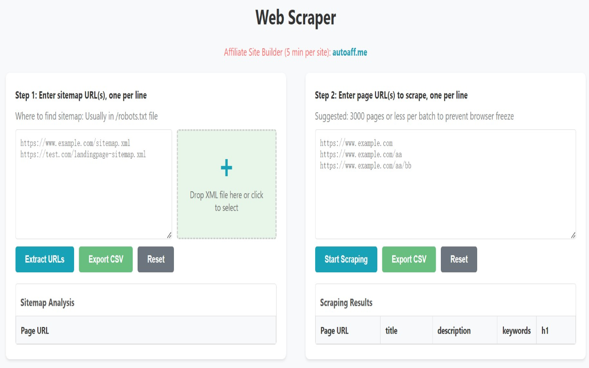

# Web Scraper/网页爬虫

## Features/功能

Web Scraper is a lightweight tool that quickly extracts the following information from web pages:
Web Scraper 是一个轻量级工具，能够快速爬取网页的以下信息：

<ul>
  <li>Title</li>
  <li>Description</li>
  <li>Keywords</li>
  <li>H1</li>
</ul>

It can also export the scraped data to a spreadsheet for easy analysis and management.
它还可以将爬取的数据导出为表格，方便分析和管理。

## Usage/使用方法

Use it via the browser extension: [Web Scraper - Simple Fast Free](https://chromewebstore.google.com/detail/web-scraper-simple-fast-f/jbponiplnhabgkangedoomdlljabhcho)
通过浏览器插件的方式使用：[网页信息一键爬取](https://chromewebstore.google.com/detail/web-scraper-simple-fast-f/jbponiplnhabgkangedoomdlljabhcho)

1. Enter a website's sitemap URL, and it will automatically parse the sitemap.
1. 输入网站的 sitemap URL，自动解析其 sitemap。

2. Copy the parsed sitemap, and it will automatically scrape information from each web page.
2. 复制解析后的 sitemap，自动爬取各网页的信息。

